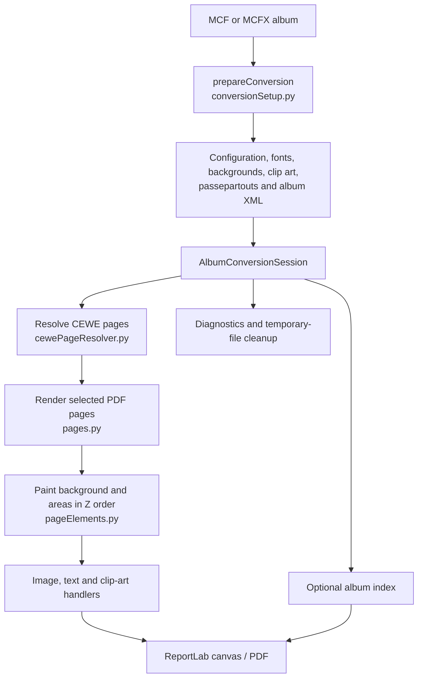
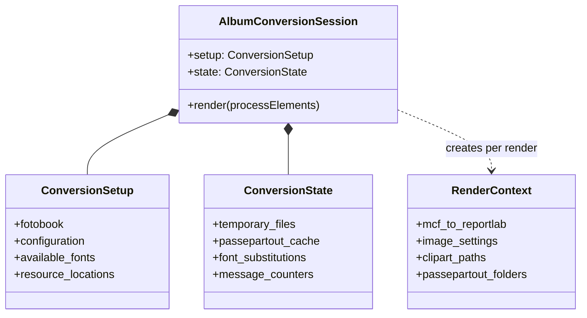

# Developer guide

This is an introduction for a programmer joining the project. It explains the current structure of the converter and its tests; it is not a second user manual. The source deliberately retains some long-established CEWE-specific code, so favour a small, well-tested change over a general rewrite.

## Start here

The command-line entry point is [`cewe2pdf.py`](cewe2pdf.py). Its public `convertMcf(...)` function is also the usual API for another Python program. One call creates an `AlbumConversionSession`, which owns the work and cleanup for one `.mcf` or `.mcfx` conversion.

Read these files in this order:

1. [`cewe2pdf.py`](cewe2pdf.py) - command line, constants and public API.
2. [`albumConversionSession.py`](albumConversionSession.py) - the conversion lifetime and high-level orchestration.
3. [`conversionSetup.py`](conversionSetup.py) - input, configuration and resource discovery.
4. [`cewePageResolver.py`](cewePageResolver.py), [`pages.py`](pages.py) and [`pageElements.py`](pageElements.py) - which CEWE pages become PDF pages, then how each page's areas are rendered.

## Conversion at a glance



`AlbumConversionSession` is the ownership boundary. It logs the version, prepares the album, creates the ReportLab canvas, renders the pages, saves the PDF, creates an optional index, reports diagnostic counts and deletes its temporary files. Its context-manager cleanup also happens after an exception.

### Data and state ownership

The project intentionally does not use conversion-time global variables. Different kinds of information are separated by how they change:



- `ConversionSetup` contains resolved input and resources which are normally fixed after startup.
- `ConversionState` contains values that deliberately accumulate or change, such as temporary file names, caches and message counters.
- `RenderContext` contains common drawing inputs passed to area handlers. It avoids every handler having its own approximation of units or image settings.
- `AlbumIndex` is deliberately separate: it is optional, mutable index data rather than general conversion state.

When adding a value, first decide which of those ownership rules it follows. Do not restore a module-level mutable global just to avoid passing a dependency.

## Pages and areas

MCF files describe CEWE product pages, which are not always one-for-one with PDF pages. `cewePageResolver.py` interprets covers, inside pages, double-page bundles, requested page numbers and the Photo Pairs memory-card product. `pages.py` renders the resolved page sequence. This separation makes the selection logic testable without producing a PDF.

For each rendered page, `pageElements.py`:

1. paints the page background;
2. gathers page areas and orders them by CEWE `zposition`;
3. delegates each area to an image, text or clip-art handler;
4. adds page numbering where requested.

Specialist modules are intentionally narrow. For example, [`imageareas.py`](imageareas.py) deals with image crop/placement and uses [`corners.py`](corners.py), [`borders.py`](borders.py) and [`shadows.py`](shadows.py) where needed. [`textareas.py`](textareas.py) coordinates HTML-like CEWE text and delegates details to modules such as `texttabs.py`, `textlists.py`, `textoutlines.py`, `textspacing.py` and `textart.py`.

MCF geometry is in tenths of a millimetre. ReportLab uses points. The `mcf_to_reportlab` value in `RenderContext` is the single conversion factor passed to renderers. Area renderers translate to an area's centre before applying rotation, then draw relative to `(0, 0)`.

## Input, configuration and resources

`conversionSetup.prepareConversion(...)` accepts either an `.mcf` XML file or an `.mcfx` SQLite container, unpacked temporarily by [`mcfx.py`](mcfx.py). It combines configuration, album-local files and CEWE installation resources. The album's `cewe2pdf.ini` overrides the normal configuration.

Missing CEWE resources are warned about rather than treated as a separate code path, so a simple text-only album can still be converted without a CEWE installation. Font handling is deliberately conservative: CEWE fonts are the normal source. Users can supply `additional_fonts.txt` beside an album, and may opt in to system-font scanning with `loadSystemFonts=True`. Tests normally set `IGNORELOCALFONTS=1` so their output does not depend on a developer's installed fonts.

## Testing and approved output

Run the normal suite with:

```bash
python runAllTests.py
```

It runs `pytest`, sets `IGNORELOCALFONTS=1`, and stops at the first failure by default. The commented alternative in `runAllTests.py` continues after failures, which is useful during interactive work.

Most feature tests follow this layout:

```text
tests/testFeature/
  testFeature.mcf                 input album and its resources
  cewe2pdf.ini                    test-specific configuration, if needed
  test_feature.py                 test driver
  previous_result_pdfs/           visually approved PDF/PNG output
```

The test driver writes a date-stamped result and uses the PDF comparison helper to compare its pixels with the most recent approved result. This is why a small intentional rendering change requires a visual inspection before its golden file is replaced. The broader `unittest_fotobook` fixture is useful for regression coverage but uses fonts unavailable on GitHub's Linux runner; its value is stable output under the configured substitutions, not exact Windows-font fidelity.

Prefer a focused fixture when implementing a CEWE feature: make the smallest album that exposes one variable at a time, keep an editor screenshot while developing it, then approve the resulting PDF only after visual comparison.

## Practical rules for changes

- Put feature-specific drawing code in a specialist module rather than growing `cewe2pdf.py` again.
- Preserve the established public `convertMcf(...)` API unless a deliberate compatibility change is being made.
- Use `ConversionSetup`, `ConversionState` and `RenderContext` according to their ownership rules instead of passing unrelated state everywhere.
- Use f-strings for new diagnostic messages. Messages are part of the user experience, so include useful dimensions and recovery advice where possible.
- Maintain CRLF line endings in touched Python and text files.
- Run the focused test first, then `python runAllTests.py`. Do not replace a golden result merely to make a test green.

## Boundaries of support

The main target is CEWE photo books. The Photo Pairs memory-card product is also explicitly handled. Other editor products, CEWE-only features and third-party HTML features may be partially rendered, ignored with a warning, or unsupported. Keep that distinction visible in code and documentation: approximate rendering is sometimes useful, but it should not be presented as pixel-identical CEWE compatibility.
