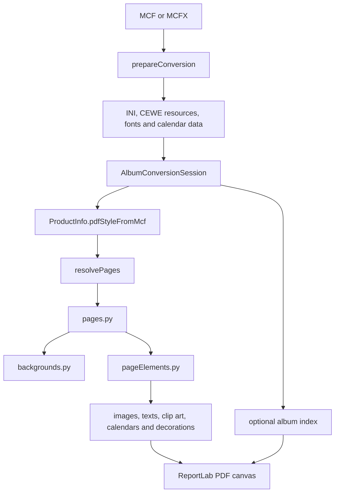

# Developer guide

This guide is for contributors working on the converter. It describes the current source layout, rendering model, and test workflow. User installation, command-line options, CEWE-resource configuration, and the standalone executable are documented in [README.md](README.md).

The converter is a careful interpretation of an undocumented CEWE format. A small, well-tested change based on an MCF fixture is usually preferable to a large theoretical rewrite.

## First steps

Python 3.12 is the supported development and CI version. Create an isolated environment and install the pinned dependencies:

```bash
python -m pip install -r requirements-pinned.txt
python runAllTests.py
```

`requirements.txt` lists direct dependencies; `requirements-pinned.txt` is the reproducible development/CI environment generated with `pip-compile`; and `requirements-winexe.txt` is the additional Windows-only PyInstaller overlay. See the README's development section before changing a dependency.

The public Python entry point is `convertMcf(...)` in [cewe2pdf.py](cewe2pdf.py). The command-line entry point is in the same file:

```bash
python cewe2pdf.py --version
python cewe2pdf.py album.mcf
```

For a first reading of the code, use this order:

1. [cewe2pdf.py](cewe2pdf.py) — command line and public conversion API.
2. [albumConversionSession.py](albumConversionSession.py) — ownership and lifetime of one conversion.
3. [conversionSetup.py](conversionSetup.py) — input, configuration, and resource discovery.
4. [ceweInfo.py](ceweInfo.py) and [cewePageResolver.py](cewePageResolver.py) — product/PDF style and CEWE page interpretation.
5. [pages.py](pages.py), [backgrounds.py](backgrounds.py), and [pageElements.py](pageElements.py) — the PDF page-rendering path.

## Conversion model



`AlbumConversionSession` is the lifetime boundary. It prepares the album, creates and saves the ReportLab canvas, owns temporary files and diagnostic counters, and cleans those resources up even when rendering fails. Do not add conversion-time mutable globals: one Python process may convert several albums.

### Data ownership

| Object | Owns |
| --- | --- |
| `ConversionSetup` | Parsed MCF, merged configuration, resolved resource locations, registered fonts, line scales, and calendar data. These are normally fixed after setup. |
| `RenderContext` | Drawing settings and shared resources passed to renderers: unit scale, resolutions, image settings, clip art/passepartout locations, and line scales. |
| `ConversionState` | Mutable per-run caches, missing-resource reports, font substitutions, temporary files, and diagnostic counters. |
| `AlbumIndex` | Optional mutable index data, deliberately separate from general state. |

MCF geometry is in tenths of a millimetre; ReportLab geometry is in points. `RenderContext.mcf_to_reportlab` is the conversion factor. Area renderers translate to the area centre, rotate, then draw around `(0, 0)`.

## Product and page interpretation

`PdfProductStyle` describes the shape of the output PDF, not CEWE's product marketing name:

- `AlbumSingleSide` is the normal album output. CEWE stores a spread, while the PDF contains individual pages.
- `AlbumDoubleSide` is selected by `--keepdoublepages` for an album.
- `Calendar` represents independently rendered calendar cover/month pages.
- `MemoryCard` represents CEWE Photo Pairs (`MEM3`) cards.

`ProductInfo.pdfStyleFromMcf(...)` derives the style from MCF structure before using an identifier fallback. In particular, calendar cover/area tags are more reliable than retailer-specific CAL identifiers. Product IDs and `ceweFormats` are fallback/diagnostic information: actual `bundlesize` values on MCF pages determine normal rendering dimensions. A diagnostic warns when the product identifier and structure disagree or a known fallback differs substantially from the MCF.

### Album pages are asymmetric

CEWE album XML does not map cleanly to visible pages. `cewePageResolver.py` is the single location for this interpretation. It yields immutable `ResolvedPage` values; `pages.py` performs drawing and decides when to call `showPage()`.

- The composite `fullcover` MCF record supplies visible cover/spine artwork. The separate `spine` record is structural metadata and is not independently drawn.
- The opening `emptypage` record can hold the first real content page, while normal page 1 supplies its background. The resolver labels those operations `FrontInsideCoverBackground` and `OpeningContentPage`.
- The final normal page holds the closing content; the trailing `emptypage` is the back inside-cover/endpaper record. Both operations share the final PDF canvas where appropriate.
- In the normal single-page PDF the inside cover/endpaper pages are omitted. In a double-page PDF, their backgrounds default to the facing content-page background. `insideCoverWhite=True` instead reproduces CEWE's white printed endpapers.

When changing those rules, extend `tests/testCewePageResolver/test_cewePageResolver.py` first. Do not scatter tests for raw CEWE `pagenr` values into area renderers.

## Source layout

The top level retains the conversion spine and cross-cutting modules. Specialist packages keep feature code out of `pageElements.py`.

| Location | Responsibility |
| --- | --- |
| `calendars/` | Calendar area rendering; CEWE schemas/layouts; localised month, weekday, holiday, and personal-event data; layout substitutions. |
| `texts/` | CEWE HTML-like text, markup, lists, tabs, spacing, outlines, and text art. |
| `decorations/` | Borders, corners, passepartouts, and shadows used by image/text/clip-art areas. |
| `clipart/` | Clip-art catalogue lookup, area rendering, and CEWE `.clp` parsing. |
| `fonts/` | Font discovery/registration, OTF handling, and line-scale rules. |
| `indexing/` | The optional cewe2pdf-only album index. |
| `infrastructure/` | Configuration helpers, paths, version/build information, logging, and Windows Explorer integration. |
| `imageareas.py`, `imageUtils.py`, `imageExtractor.py` | Image-area rendering, shared image helpers, and image extraction. Image rendering remains top-level because it is tightly coupled to page-area traversal. |
| `colorUtils.py`, `colorFrame.py` | Shared CEWE colour decoding and colour-frame support. |
| `pageNumbering.py` | Optional page-number drawing. |

Package `__init__.py` files deliberately contain no public façade. Import the specific module which provides the operation you need.

`pageElements.py` paints areas in CEWE z-order and delegates to the specialist modules. Keep it a coordinator: put feature-specific interpretation and drawing in the appropriate package whenever possible.

## Calendars

Calendar support is data-driven from the MCF and CEWE resources:

- Calendar detection comes from `calendarcoverfront` / `calendariumarea` structure, with CAL product IDs as compatibility fallbacks.
- `calendar_schema.xml` supplies cell colours/styles and `calendar_layout.xml` supplies named layout geometry.
- Language resources supply month names, weekday labels, and holiday/event definitions. Do not add a Python list of national holidays or month names as a general fallback when the relevant CEWE resource can be located.
- Portable test fixtures under `tests/Resources/calendar*` provide minimum data for self-contained calendar tests. A real configured CEWE installation provides delivered resources instead.

New calendar behaviour should begin with a small MCF fixture and an editor screenshot. Use layout/schema data or MCF attributes rather than product-ID or month-specific adjustments.

## Configuration and resources

`prepareConversion(...)` reads `cewe2pdf.ini` from the current directory, then from the album directory; later settings override earlier ones. The album-specific file is normally the least surprising place for user settings. `additional_fonts.txt` is searched in album directory, current directory, and program directory, using the first one found.

The converter can render simple albums without CEWE installed. It warns about unavailable CEWE fonts, backgrounds, clip art, and passepartouts rather than inventing a separate no-CEWE code path. Tests use fixture resources and set `IGNORELOCALFONTS=1` so a developer's local fonts do not alter approved PDFs.

Keep resource lookup data-driven. Add a configurable or fixture location before hard-coding a machine-specific AppData or installation path.

## Logging and diagnostics

`infrastructure/extraLoggers.py` defines named loggers:

- `cewe2pdf.mustsee` — short, user-visible conversion facts such as the product diagnostic and rendered side.
- `cewe2pdf.config` — configuration and font-resource diagnostics.
- `cewe2pdf.page_rendering` — focused debug trace of opening/closing content and inside-cover/endpaper backgrounds actually sent to the PDF canvas.

`loggerconfig.yaml` is read at import time from the **process working directory**, not beside the MCF or test file. It enables the focused `page_rendering` trace without enabling all root debug output. A Visual Studio test launch may use the project directory as its working directory; do not assume it uses the selected test's directory.

Explorer automatic mode writes `<album>.mcf.log` or `<album>.mcfx.log` beside the album. It attaches the automatic file handler to all named loggers that do not propagate, including `page_rendering`, so the same trace is retained after Explorer closes the console.

Use `mustsee` for important conversion facts, ordinary `logging` for general diagnostics, and a specialised named logger only for a coherent optional trace. Avoid adding high-volume detail to `mustsee`.

## Tests and approved output

Run all tests:

```bash
python runAllTests.py
# Or, without the helper's stop-at-first-failure behaviour:
python -m pytest -rs
```

Useful focused runs:

```bash
python -m pytest tests/testCewePageResolver/test_cewePageResolver.py -q
python -m pytest tests/testCalendar -q
python -m pytest -rs --ignore=tests/testCalendar
```

Most rendering tests have this form:

```text
tests/testFeature/
  example.mcf
  example_mcf-Dateien/             album pictures, where needed
  cewe2pdf.ini                     fixture resource configuration, where needed
  test_feature.py
  previous_result_pdfs/            approved PDF/PNG results
```

Tests create date-stamped PDFs and compare them pixel-for-pixel with the newest approved result. This makes visual inspection mandatory before updating a golden result: a passing comparison proves only that output matches the approved rendering, not that it matches CEWE. Keep editor screenshots or notes for fixtures which demonstrate reverse-engineered behaviour.

`tests/testPageNumbers` demonstrates controlled programmatic edits to an MCF for several related cases. Prefer a compact dedicated fixture when isolating a new CEWE feature.

### Linting

The GitHub workflow treats Python syntax/undefined-name flake8 findings as errors and reports broader style/complexity findings as warnings. Run:

```bash
python -m flake8 .
python -m pylint --rcfile=.pylintrc *.py calendars clipart decorations fonts indexing infrastructure texts
```

Use a local pylint suppression only when the parameter-rich rendering boundary is genuinely clearer than an artificial wrapper; explain the reason in a nearby comment.

### Cleaning generated test output

Do not delete approved PDFs under `previous_result_pdfs`, or album images under a `Dateien` directory. The canonical PowerShell discovery pattern and Recycle Bin cleanup command are maintained in the [README cleanup section](README.md#cleaning-up-temporary-files). Review listed files before sending them to the Recycle Bin, especially when extending the pattern for a new fixture naming convention.

## Change discipline

- Preserve the public `convertMcf(...)` API unless making an explicit compatibility decision.
- Derive rendering from MCF tags and installed/fixture resources before adding product-ID, language, or layout-specific code.
- Keep page selection in `cewePageResolver.py`, page-level canvas policy in `pages.py`/`backgrounds.py`, and area-specific drawing in a specialist module.
- Add focused tests before updating a golden PDF. Run the focused test, then the full suite.
- Keep CRLF line endings in touched Python and text files.
- Treat messages as part of the user interface: state the useful fact, include dimensions or recovery advice where applicable, and avoid speculative claims of pixel-identical CEWE compatibility.

## Support boundary

The primary target is CEWE albums. Calendar pages and the Photo Pairs memory-card product have explicit support. CEWE-only or third-party features can be approximated, omitted with a warning, or unsupported. Keep that distinction visible in both code and documentation.
